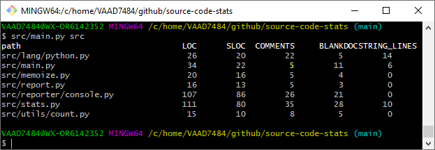

A utility to get a number of stats about your source code: sloc, # of comments etc...

It is designed to be easily extensible:
- language support: currently, it is limited to python, but adding other languages would be mostly as easy as defining regexp for that language
- reporters: currently, reports are output to the console, but other reporters (e.g. html) could be done

It is still WIP.

# Why

I initiated this as I was reviewing a third party repo with almost no comments,
and no empty lines to delimit blocks. The code itself was ok, but reading the source
was annoying. 
Also, I stumbled upon this [stackoverflow question](https://stackoverflow.com/questions/38543709/count-lines-of-code-in-directory-using-python),
and decided it would be a nice exercise to implement such a tool.

# Usage

```bash
$ src/main.py -h
usage: main.py [-h] [-v] path
```

For instance, it can provide stats about its own source code:

```bash
src/main.py src/
```
